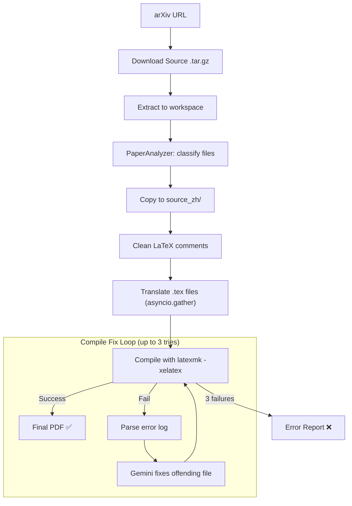

# ReadPaper Architecture

All AI operations use **Gemini 3.0 Flash** (`gemini-3-flash-preview`).

## System Overview

ReadPaper consists of two services deployed on Google Cloud Run:

1. **Frontend (Next.js)** — User interface: paper search, translation trigger, progress display with token usage, split-view PDF reader.
2. **Backend (FastAPI)** — Translation pipeline: arXiv download, analysis, Gemini translation, XeLaTeX compilation. IPC-based progress streaming.

## Translation Pipeline



### Step 1: Download + Extract

`downloader.py` downloads the arXiv e-print tarball and `extract_source()` handles tar.gz, gzipped single-file, and plain-text archives.

### Step 2: PaperAnalyzer

`analyzer.py` classifies every file in the workspace:

| Classification | Description | Action |
|---|---|---|
| `main` | The main `.tex` file (contains `\documentclass`) | Translate |
| `sub_content` | Input/included files with translatable prose | Translate |
| `macro` / `style` | Package/macro definition files | Skip |
| `bib` | Bibliography files | Skip |
| `non_tex` | Images, data files, etc. | Skip |

### Step 3: Whole-File Translation

Each translatable `.tex` file is sent to Gemini in a **single API call**:

- **Prompt**: `whole_file_translation_prompt.txt` — instructs Gemini to translate English text, preserve all LaTeX structure, and add CJK support
- **Concurrency**: `asyncio.gather()` with `Semaphore(MAX_CONCURRENT_REQUESTS)` (default: 4)
- **Retry**: 3 attempts with exponential backoff per file
- **Validation**: Output must be non-empty and >20 characters

| What Gets Translated | What Stays Untouched |
|---|---|
| Prose text (paragraphs, section titles) | `\cite{}`, `\ref{}`, `\label{}` |
| Comments in English | Math (`$...$`, `\begin{equation}`) |
| Caption text | LaTeX commands and environments |
| Abstract, introduction, etc. | Preamble package options |

### Step 4: AI Compile Fix Loop

`compiler.py` runs `latexmk -xelatex` with flags:
- `-interaction=nonstopmode` — no user input prompts
- `-f` — force PDF generation despite non-critical errors
- `-file-line-error` — machine-parseable error locations

On failure:
1. `parse_latex_error()` extracts the failing file + line + error type
2. `ai_fix_file()` sends the file + error snippet to Gemini with `latex_fix_prompt.txt`
3. Compilation is retried (up to 3 attempts)

**Dynamic Timeout**: `300s + (total_output_tokens / 10000) * 60s`, capped at 1200s.

## IPC Protocol

The subprocess (`arxiv_translator/main.py`) communicates with the backend (`main.py`) via stdout IPC messages:

| Code | Format | Description |
|---|---|---|
| `DOWNLOADING` | — | Source download started |
| `EXTRACTING` | — | Archive extraction started |
| `PRE_FLIGHT` | — | Pre-flight checks (analysis, cleanup) |
| `FILE_LIST` | `file1,file2,...` | List of files to translate |
| `TRANSLATING` | `count:total:message` | Per-file translation progress |
| `FILE_DONE` | `filename:ok/fail` | File translation complete |
| `TOKENS_TOTAL` | `in:out:filename` | Per-file token usage |
| `TOKENS_SUMMARY` | `total_in:total_out` | Final total token counts |
| `COMPILING` | `message` | PDF compilation started |
| `COMPLETED` | `message` | Success |
| `FAILED` | `message` | Error |

## Storage

Two backends via `StorageService`:
- **Local**: Files on disk at `./paper_storage/`
- **GCS**: Google Cloud Storage with bucket prefix per user

Stored per paper:
- `original.pdf` — Original English PDF
- `translated.pdf` — Translated Chinese PDF
- `tex/original/` — Original `.tex` source files
- `tex/translated/` — Translated `.tex` source files
- `status.json` — Cached translation status

## Local Development

```bash
cp .env.example .env
# Set GEMINI_API_KEY, DISABLE_AUTH=true
./run_conda_local.sh
```

Requirements:
- **TeX Live** with `latexmk`, `xelatex`, and `fandol` fonts
- Fallback: Docker with `ghcr.io/xu-cheng/texlive-full`
