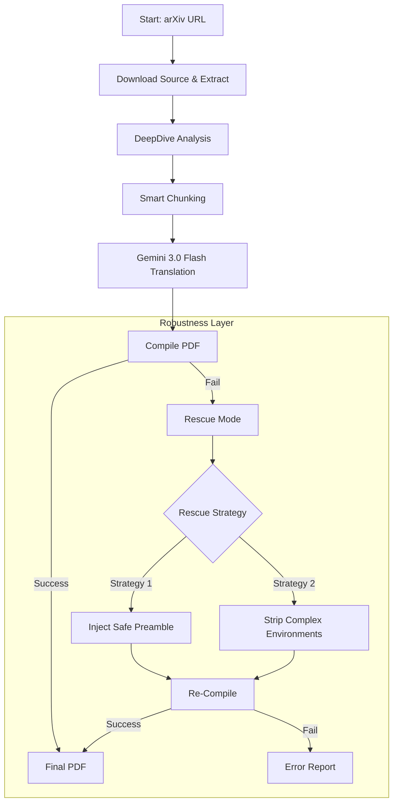

# ReadPaper Architecture & Robustness Pipeline

This document details the technical architecture of ReadPaper, focusing on the sophisticated translation and compilation pipeline. **All AI calls in this project use Gemini 3.0 Flash (`gemini-3-flash-preview`)** 

## System Overview

ReadPaper consists of two main services:
1.  **Frontend (Next.js)**: Handles user interaction, PDF rendering, and side-by-side view.
2.  **Backend (FastAPI)**: Manages the heavy lifting of downloading, analyzing, translating, and compiling papers.

## The Translation Pipeline (Robust Mode)

The core innovation of ReadPaper is its "Robustness Pipeline 2.0", designed to ensure a readable PDF is produced even when the AI generates imperfect LaTeX or when the source material is fragile.

### 1. DeepDive Analysis
Before translation, the `DeepDiveAnalyzer` scans the paper for technical concepts (equations, theorems, architectures). It uses a specialized prompt to generate "Insight Cards" which are then injected into the translation stream.

### 2. Smart Chunking (Paragraph-Aware)
Standard line-based chunking often breaks LaTeX environments (e.g., splitting a `\begin{equation}` block).
-   **Old Logic**: Split every N lines.
-   **New Logic**: Splits only on paragraph boundaries (empty lines) or when a hard token limit is reached, preserving the structural integrity of LaTeX blocks.

### 3. Gemini 3.0 Flash Translation

All AI operations use **Gemini 3.0 Flash** (`gemini-3-flash-preview`) exclusively:

| Operation | Model | Purpose |
|---|---|---|
| Text-node translation | `gemini-3-flash-preview` | Translate prose-only text batches to Chinese |
| DeepDive analysis | `gemini-3-flash-preview` | Generate explanation boxes after dense paragraphs |
| Compile error fixing | `gemini-3-flash-preview` | Parse LaTeX error logs and apply targeted fixes |

> **Why Gemini 3.0 Flash?** The large context window handles full-document batches without chunking overhead, while the Flash tier provides the speed needed for sub-5-minute end-to-end translation of typical papers.

The system uses a strict `text_only_translation_prompt.txt` system prompt instructing the model to output **only** the Chinese translation — no LaTeX commands, no markdown, no preamble.

### 4. Robust Compilation
We use `latexmk` with a specifically tuned configuration:
-   `-interaction=nonstopmode`: Prevents the compiler from hanging on user input.
-   `-f` (Force): Compels the engine to produce a PDF even if non-critical errors (like missing fonts or minor syntax issues) are encountered.

### 5. Rescue Mode (LatexRescuer)
If the standard compilation fails, the **LatexRescuer** intervenes. It does **not** rely on AI (which can hallucinate fixes). Instead, it uses deterministic rules:
-   **Safe Preamble**: Replaces the original (often fragile) preamble with a standardized `ctex`-compatible version.
-   **Environment Stripping**: If the first rescue fails, it strips out complex environments like `figure`, `table`, and `algorithm`, leaving the core text and equations intact.

## Local Development (Conda)

For local development, we provide `run_conda_local.sh`, which:
-   Loads environment variables from `.env`.
-   Starts the Backend on port 8000.
-   Starts the Frontend on port 3000.
-   Manages process lifecycles (cleanup on exit).

### Requirements
-   **TeX Live**: Required for local compilation. If `latexmk` is missing, the backend attempts to use Docker (`ghcr.io/xu-cheng/texlive-full`), but this is slower.
