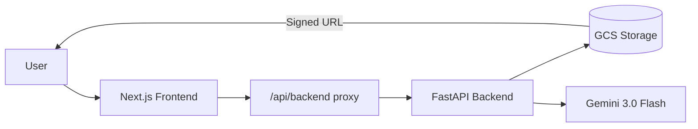
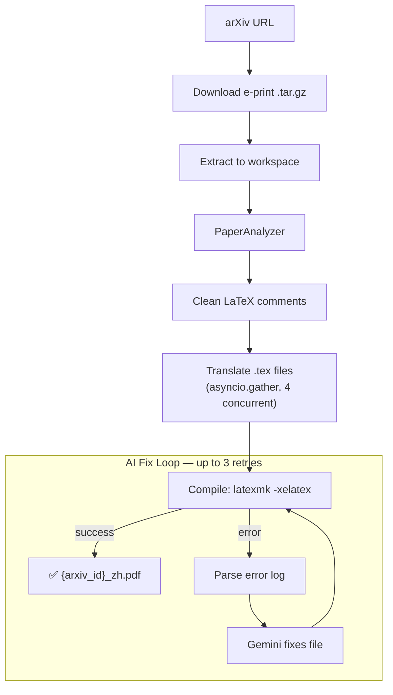

# Architecture

> All AI operations use **Gemini 3.0 Flash** (`gemini-3-flash-preview`) with its 1M-token context window.

## System Overview



Two Cloud Run services, one GCS bucket:

| Service | Stack | Role |
|---------|-------|------|
| **Frontend** | Next.js 14 + NextAuth.js | OAuth login, paper library, split-view PDF reader, admin dashboard |
| **Backend** | FastAPI + Python 3.11 | Translation pipeline, PDF delivery (signed URLs), status streaming |
| **Storage** | Google Cloud Storage | Per-user paper storage (`users/{email}/{arxiv_id}/`) |

## Translation Pipeline



### PaperAnalyzer (`analyzer.py`)

Classifies every file in the source tree:

| Type | Example | Action |
|------|---------|--------|
| `main` | File with `\documentclass` | Translate |
| `sub_content` | `\input`/`\include` targets with prose | Translate |
| `macro` / `style` | `.sty`, macro-only `.tex` | Skip |
| `bib` | `.bib` files | Skip |
| `non_tex` | Images, data, config | Skip |

### Translator (`translator.py`)

- **One API call per file** — complete `.tex` content as input, translated output
- **Prompt** (`prompts/whole_file_translation_prompt.txt`): translate English text, preserve all LaTeX structure, add `\usepackage[UTF8]{ctex}`
- **Concurrency**: `asyncio.gather()` with `Semaphore(4)` — configurable via `MAX_CONCURRENT_REQUESTS`
- **Retry**: 3 attempts per file with exponential backoff
- **Validation**: output must be non-empty and >20 characters

### Compiler (`compiler.py`)

Runs `latexmk -xelatex` with:
- `-interaction=nonstopmode` — no interactive prompts
- `-f` — force through non-critical errors
- `-file-line-error` — machine-parseable error locations

**Dynamic timeout**: `base 300s + (output_tokens / 10000) × 60s`, capped at 1200s.

On failure: `parse_latex_error()` → `ai_fix_file()` with `latex_fix_prompt.txt` → retry.

## PDF Delivery

PDFs are served via **cached GCS signed URLs** — the browser downloads directly from storage.

```
Request flow:
1. Browser → fetch("/backend/paper/{id}/translated") → Proxy → Backend
2. Backend checks signed URL cache (dict, 12-min TTL)
   → Cache hit: return JSON instantly (~5ms)
   → Cache miss: blob.exists() + IAM signBlob → cache & return (~700ms)
3. Backend returns: {"url": "https://storage.googleapis.com/...?X-Goog-Signature=..."}
4. Browser sets iframe.src = signed URL (direct GCS download, 1 hop)
```

**Why not stream through backend?**
Streaming route: Browser → Proxy → Backend → GCS → Backend → Proxy → Browser (3 hops, ~3s TTFB for 6MB).
Signed URL route: Backend returns 900-byte JSON → Browser loads directly from GCS (1 hop).

**Fallback**: if IAM signBlob fails, backend streams `download_as_bytes()` directly.

## IPC Protocol

The translation subprocess communicates progress via stdout:

| Code | Format | Example |
|------|--------|---------|
| `DOWNLOADING` | — | Source download started |
| `EXTRACTING` | — | Archive extraction |
| `FILE_LIST` | `file1\|file2\|...` | Files to translate |
| `TRANSLATING` | `count:total:msg` | `3:7:Translating main.tex` |
| `FILE_DONE` | `filename:ok/fail` | `main.tex:ok` |
| `TOKENS_TOTAL` | `in:out:filename` | `12500:14200:main.tex` |
| `TOKENS_SUMMARY` | `total_in:total_out` | `45000:52000` |
| `COMPILING` | `msg` | `Compiling PDF (timeout 420s)` |
| `COMPLETED` / `FAILED` | `msg` | Final status |

## Authentication

| Layer | Implementation |
|-------|---------------|
| **Frontend** | NextAuth.js v5 with Google OAuth provider |
| **Backend** | Validates Google ID token via `google.auth.transport`, or accepts `x-user-email` header from trusted proxy |
| **Admin** | Hardcoded admin email check in `/admin` page |

## Storage Layout

Per-user files in GCS at `users/{email}/{arxiv_id}/`:

```
users/user@gmail.com/2602.15763/
├── 2602.15763.pdf          # Original from arXiv
├── 2602.15763_zh.pdf       # Translated Chinese PDF
└── tex/
    ├── original/           # Original .tex source files
    └── translated/         # Translated .tex source files
```

## Translation Cache (`services/cache.py`)

- **Key**: `{email}/{arxiv_id}/status.json` in GCS
- **Hit**: status == `completed` with valid token counts → paper added to library instantly
- **Integrity**: validates token counts are non-zero before accepting cache

## Cloud Run Configuration

```yaml
# Backend
--cpu=2
--memory=4Gi
--timeout=900
--no-cpu-throttling    # Critical: background compilation needs CPU after response
--min-instances=1      # Avoid cold starts
```

## Local Development

```bash
cp .env.example .env
# Set: GEMINI_API_KEY=..., DISABLE_AUTH=true, STORAGE_TYPE=local
./run_conda_local.sh
```

**Requirements**: Python 3.11+, Node.js 18+, TeX Live (`latexmk`, `xelatex`, `fandol` fonts)
