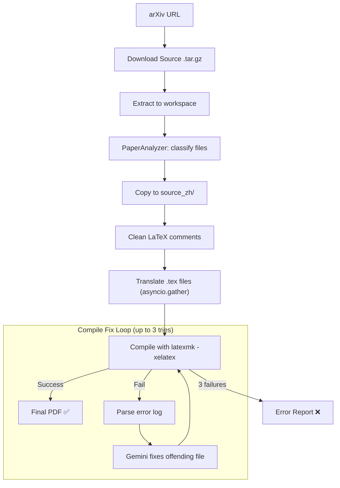

# ReadPaper Architecture

All AI operations use **Gemini 3.0 Flash** (`gemini-3-flash-preview`).

## System Overview

ReadPaper consists of two services deployed on Google Cloud Run:

1. **Frontend (Next.js)** — User interface: Google OAuth login, paper search, translation trigger, progress display with token usage, split-view PDF reader, admin dashboard.
2. **Backend (FastAPI)** — Translation pipeline: arXiv download, analysis, Gemini translation, XeLaTeX compilation. IPC-based progress streaming. PDF delivery via GCS signed URLs.

## Translation Pipeline



### Step 1: Download + Extract

`downloader.py` downloads the arXiv e-print tarball and `extract_source()` handles tar.gz, gzipped single-file, and plain-text archives.

### Step 2: PaperAnalyzer

`analyzer.py` classifies every file in the workspace:

| Classification | Description | Action |
|---|---|---|
| `main` | The main `.tex` file (contains `\documentclass`) | Translate |
| `sub_content` | Input/included files with translatable prose | Translate |
| `macro` / `style` | Package/macro definition files | Skip |
| `bib` | Bibliography files | Skip |
| `non_tex` | Images, data files, etc. | Skip |

### Step 3: Whole-File Translation

Each translatable `.tex` file is sent to Gemini in a **single API call**:

- **Prompt**: `whole_file_translation_prompt.txt` — instructs Gemini to translate English text, preserve all LaTeX structure, and add CJK support
- **Concurrency**: `asyncio.gather()` with `Semaphore(MAX_CONCURRENT_REQUESTS)` (default: 4)
- **Retry**: 3 attempts with exponential backoff per file
- **Validation**: Output must be non-empty and >20 characters

| What Gets Translated | What Stays Untouched |
|---|---|
| Prose text (paragraphs, section titles) | `\cite{}`, `\ref{}`, `\label{}` |
| Comments in English | Math (`$...$`, `\begin{equation}`) |
| Caption text | LaTeX commands and environments |
| Abstract, introduction, etc. | Preamble package options |

### Step 4: AI Compile Fix Loop

`compiler.py` runs `latexmk -xelatex` with flags:
- `-interaction=nonstopmode` — no user input prompts
- `-f` — force PDF generation despite non-critical errors
- `-file-line-error` — machine-parseable error locations

On failure:
1. `parse_latex_error()` extracts the failing file + line + error type
2. `ai_fix_file()` sends the file + error snippet to Gemini with `latex_fix_prompt.txt`
3. Compilation is retried (up to 3 attempts)

**Dynamic Timeout**: `300s + (total_output_tokens / 10000) * 60s`, capped at 1200s.

## IPC Protocol

The subprocess (`arxiv_translator/main.py`) communicates with the backend (`main.py`) via stdout IPC messages:

| Code | Format | Description |
|---|---|---|
| `DOWNLOADING` | — | Source download started |
| `EXTRACTING` | — | Archive extraction started |
| `PRE_FLIGHT` | — | Pre-flight checks (analysis, cleanup) |
| `FILE_LIST` | `file1,file2,...` | List of files to translate |
| `TRANSLATING` | `count:total:message` | Per-file translation progress |
| `FILE_DONE` | `filename:ok/fail` | File translation complete |
| `TOKENS_TOTAL` | `in:out:filename` | Per-file token usage |
| `TOKENS_SUMMARY` | `total_in:total_out` | Final total token counts |
| `COMPILING` | `message` | PDF compilation started |
| `COMPLETED` | `message` | Success |
| `FAILED` | `message` | Error |

## PDF Delivery

PDFs are served via **GCS Signed URLs** to avoid proxying large files through the backend:

1. Frontend calls `/paper/{arxiv_id}/original` or `/paper/{arxiv_id}/translated`
2. Backend checks known PDF paths in GCS directly (no `list_files()` overhead)
3. Generates a time-limited signed URL (15 min) via IAM `signBlob` API
4. Returns JSON `{"url": "https://storage.googleapis.com/...?X-Goog-Signature=..."}`
5. Frontend sets the signed URL directly as iframe `src`

Fallback: if signed URL generation fails, backend proxies the download via `download_as_bytes`.

## Storage

Two backends via `StorageService`:
- **Local**: Files on disk at `./paper_storage/`
- **GCS**: Google Cloud Storage with bucket prefix per user (`users/{email}/{arxiv_id}/`)

Stored per paper:
- `{arxiv_id}.pdf` — Original English PDF
- `{arxiv_id}v{N}_zh.pdf` — Translated Chinese PDF
- `tex/` — Source `.tex` files (original and translated)
- `status.json` — Cached translation status with token counts

## Translation Cache

`services/cache.py` provides GCS-backed caching with integrity validation:

- **Cache key**: `{email}/{arxiv_id}/status.json`
- **Hit condition**: `status == "completed"` with valid token counts
- **On hit**: Paper is added to the user's library instantly without re-translation
- Prevents duplicate Gemini API usage for previously translated papers

## Authentication

- **Frontend**: NextAuth.js v5 with Google OAuth provider
- **Backend**: Validates Google ID token via `google.auth.transport` or accepts `x-user-email` header
- **Admin**: `/admin` page with user/paper management and delete operations

## Admin Dashboard

The admin dashboard (`/admin`) provides:

- **Overview**: Total users, papers, translations, and storage usage
- **User Management**: Browse users, view their papers, delete user data
- **Paper Management**: View all translated papers, re-trigger compilation, delete papers
- **System Health**: Model usage statistics, recent activity

## Cloud Run Configuration

Backend Cloud Run service is optimized for long-running translation tasks:

| Setting | Value | Reason |
|---|---|---|
| `--cpu` | `2` | Sufficient CPU for parallel LaTeX compilation |
| `--memory` | `4Gi` | Large papers need memory for TeX processing |
| `--timeout` | `900` | 15-minute timeout for long compilations |
| `--no-cpu-throttling` | enabled | Background tasks get full CPU after HTTP response returns |
| `--min-instances` | `1` | Avoid cold starts |

## Local Development

```bash
cp .env.example .env
# Set GEMINI_API_KEY, DISABLE_AUTH=true
./run_conda_local.sh
```

Requirements:
- **TeX Live** with `latexmk`, `xelatex`, and `fandol` fonts
- Fallback: Docker with `ghcr.io/xu-cheng/texlive-full`
